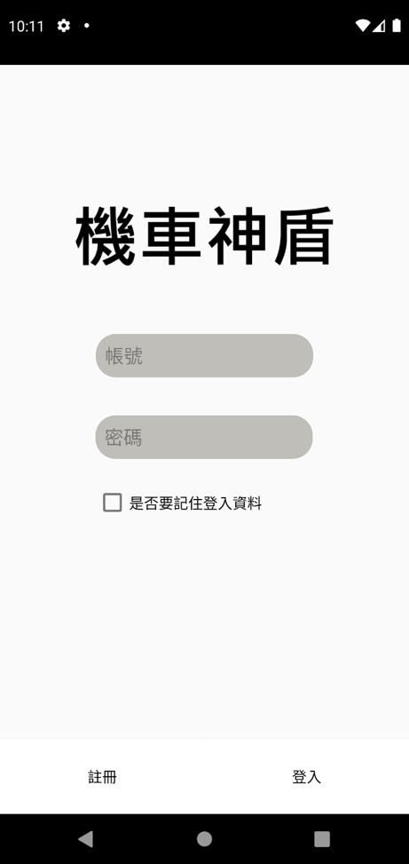
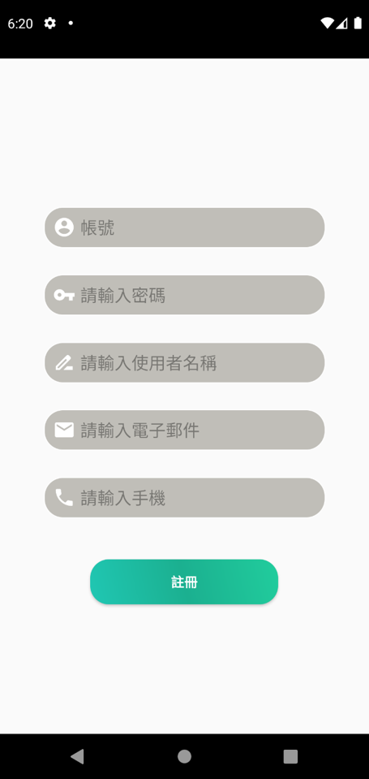
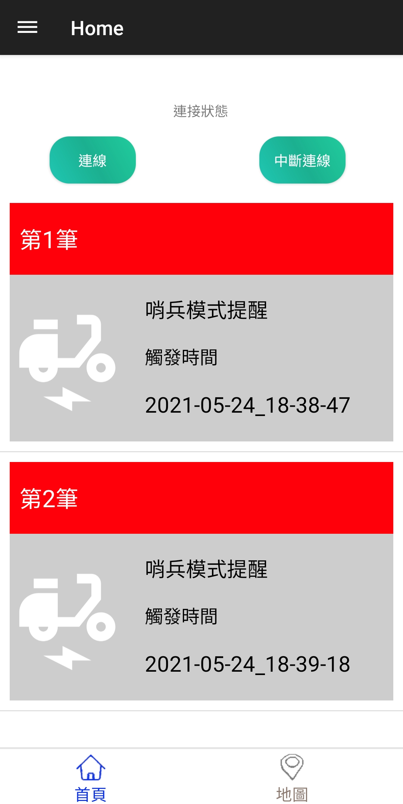
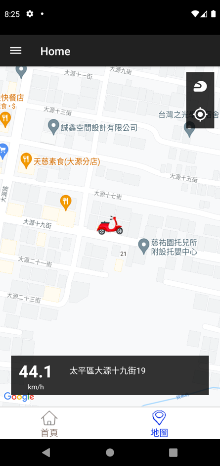

# 畢業專題-機車神盾(PHP)

## 系統特色與目的
- 結合Google地圖資訊完成自動打方向燈機制來降低車禍發生機率及違規造成的荷包損失
- 當機車被移動時，系統自動啟動攝影機錄影及發出通知
- 透過連結google雲端硬碟，可立即觀看即時資訊影像，有效找尋肇事者
- 透過GPS系統可查看車輛即時位置

## 工作分配
|			陳峰楷(組長)		|			吳易哲				|				魏宏諭				|
|-------------------------------|-------------------------------|-----------------------------------|
|	硬體-機車方向燈電路更改	    |	硬體-自動打方向燈控制程式	|	前端-Android  UI程式設計		|
|	硬體-4G模組程式撰寫	  		|	硬體-陀螺儀控制程式			|	前端-google地圖通知擷取程式		|
|	後端-Server 架設			|	硬體-攝影機控制程式			|	前端-google 地圖呈現機車位置程式|
|	後端-My-SQL架設				|	軟體-藍芽連接程式			|	前端-推播通知顯示程式			|
|	後端-PHP程式撰寫			|	後端-google雲端授權			|	後端-背景執行程式				|
|	後端-機車GPS即時通知程式	|
|	整合						|

## 介紹影片

> 直接點選上方照片即可觀看影片

## 登陸畫面

## 註冊畫面

## 主頁面

## 機車及時位置

## 此程式的功能
負責處理即時位置、登入、註冊等

## 其他相關程式

總共透過三個程式完成本專案，分別為Android APP、PHP、Raspberry-pi(Python)

[Scooter-Android](https://github.com/timtimno1/Scooter-Android)

Scooter-RaspberryPi
